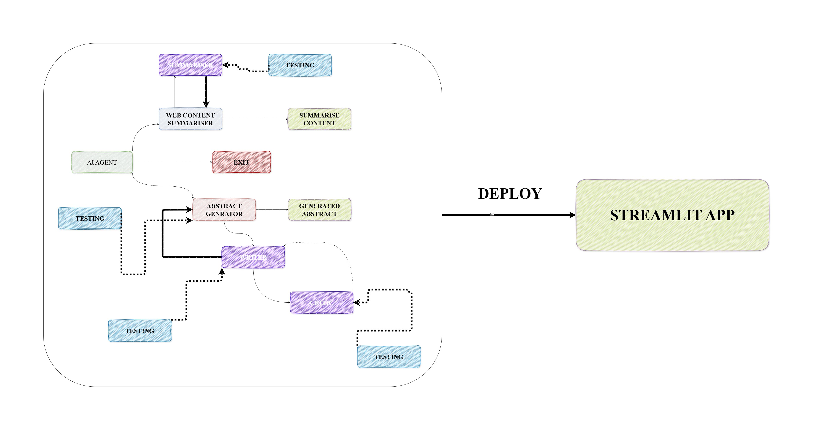
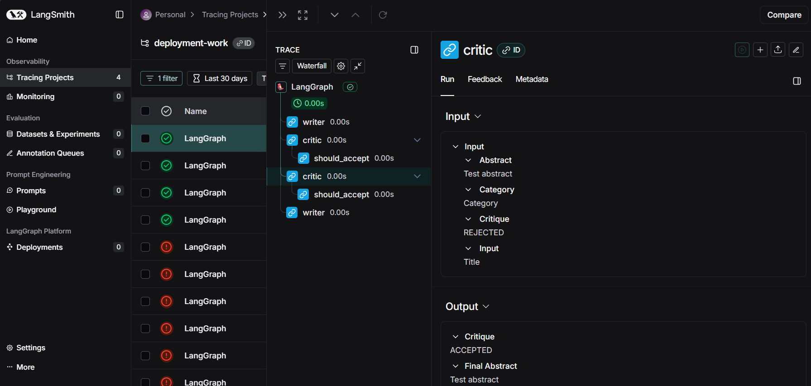
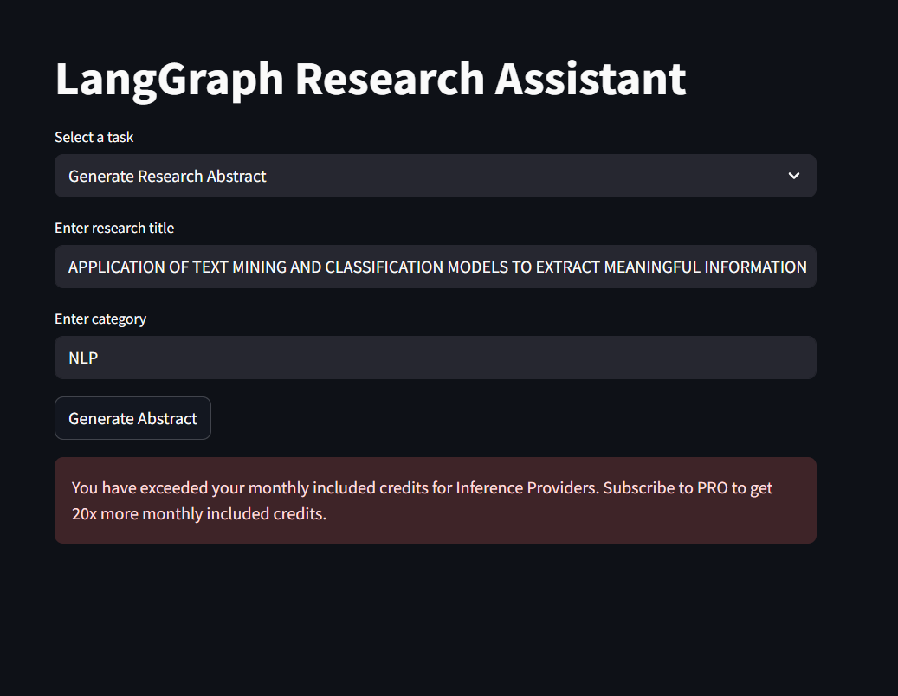
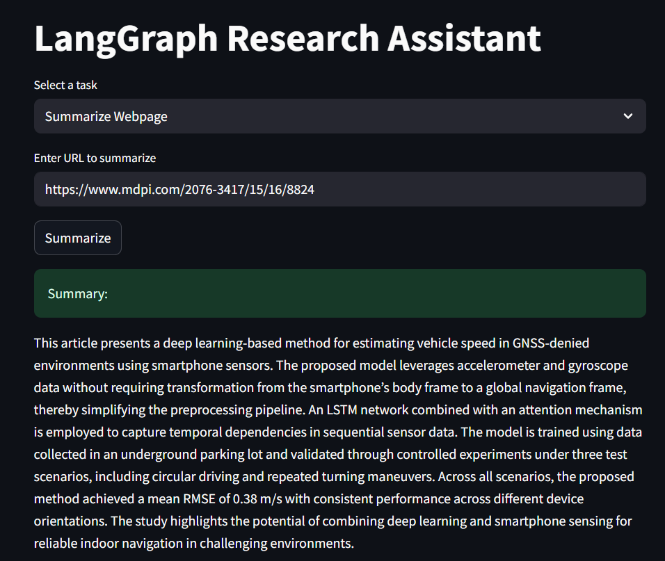
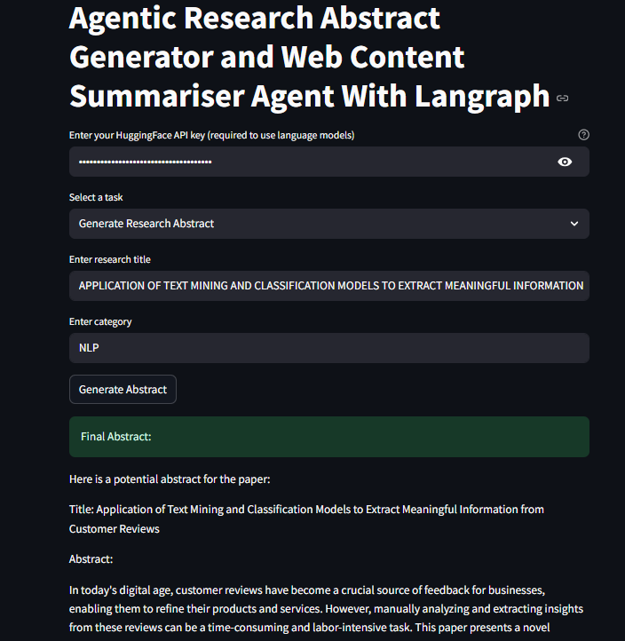
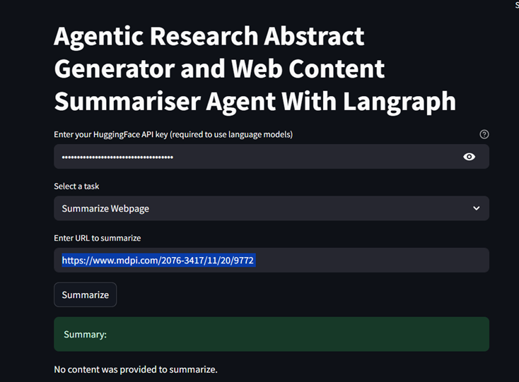

## 🧠 Agentic Research Abstract Generator & Web Summariser-2
An agent-based system using LangGraph and HuggingFace models to generate research abstracts and summarize web content, with modular workflows, memory handling, and task-specific agents.

This builds upon the previous repo 
- [Project Link](https://github.com/daniau23/agentic_researcher)
- [ReadyTensor-Publication](https://app.readytensor.ai/publications/the-agentic-research-abstract-generator-and-web-content-summariser-agent-with-langraph-gYeyu875mKsB)

### 🚀 Features Improvements
- 📈 Evaluation metrics and logging
- 📈 Evaluation metrics and logging
- 📈 Testing features incorporated
- 🚀 Model deployment with streamlit

### **How the project goes**
- All files can only work after installing all dependencies in the `environment.yml` file
- The `notebooks folder` contains the jupyter notebook file for testing the project as a whole and for experimenting. `research_graph2.ipynb` contains the experimentation for abstract generation while `research_graph3.ipynb` contains the experimentation for web content summarisation.
- The `graph_article` folder contains the critic, writer and graph_article python files. The `writer.py`(writer agent) file takes the category and title needed for drafting the abstract while the `critic.py` (reviewer agent) reviews the generated abstract. The `graph_article.py` connects boths `writer.py`and `critic.py` by using LangGraph.
- The graph_web folder contains the grap_web, loader, search and summarizer python files. The `search.py` (search agent) file searches takes in the URL link for web search, while the `loader.py` (loader agent) loads the web page but limits it to appoximately 32,000 tokens to not exceed the max token limit. The summarizer agent in `summarizer.py` files, provides a concise summary for the the URL given. The graph_web.py connects all components together as one.
- The utils folder contains the `visualizer.py` file which creates the graphs of the `grah_web.py` and `graph_article.py` files when called in `main.py`. The generatd graphs are saved to the visuals folder.
- The `shared.py` file contains the shared state for the summarizer and abstract generator graphs.
- The `main.py` file calls all graphs together and prompts the user for if the would like to generate an abstract or summarise a webpage.
- The img folder contains the images used for visualisation, also `Langsmith_run.png` show the an example run when Langsmith is used for tracing the graph.
- The tests folder contains all necessary tests for the each component for proper integration of the project, making it ready for deployment.

### **Replicating this project and Example Usage**
- Kindly refer to the GitHub link for the previous project for replication.
- **Run `pip install pytest>=8.4` and `pip install pytest-mock==3.14` after using the environment.yml from the previous repo**

### **Example Streamlit Outputs in Development**

### **Example Streamlit Outputs in Production**

**NB:** 
- **You must have a huggingface api key to use the streamlit app. Kindly refer to the previous github repo to know how to generate a huggingface api key**

Here is the Publication on;
- [ReadyTensor](https://app.readytensor.ai/publications/langgraph-agentic-research-abstract-generator-and-web-content-summariser-agent-with-streamlit-J0fCORmpykZn)

### **Issues faced**:
- Integrating tests for the LLM agents
- Conflicts when deploying app on Streamlit, hence the environment.yml file was removed. 
- Selenium was hard to incorporate for deployment, hence beautisoup was used for an attempt to read the web data